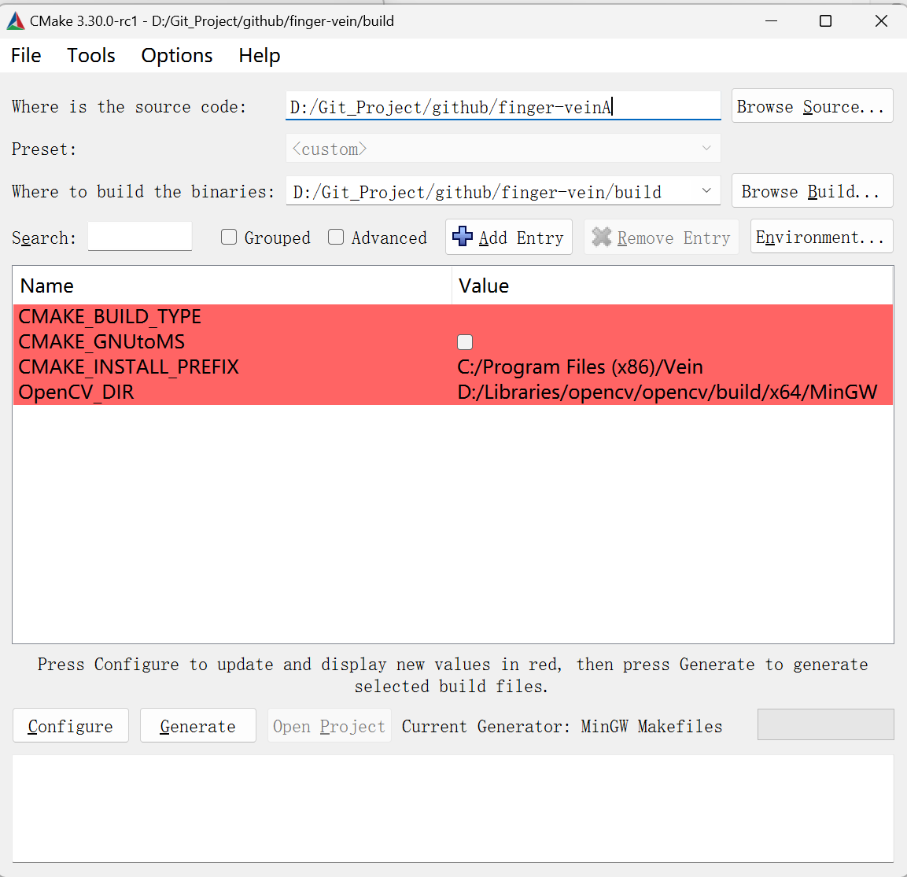
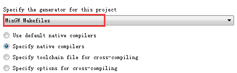

# MachineVisionWin

## 在windows中如何使用cmake编译工程

在各目录下配置好CmakeLists.txt等文件之后，就相当于搭建一个cmake工程的描述体系，因此下一步要做的就是使用cmake按照这些描述生成cmake工程

由于cmake默认使用的编译器往往不能够满足使用需求，因此可以下载安装MinGW编译器，并且在cmake生成的时候手动修改

```bash
mkdir build
cd build
cmake .. -G "MinGW Makefiles"
minGW32-make -j 8
```

首先可以创建一个文件夹build用于存放cmake工程

然后进入文件夹使用cmake命令生成工程，并且指定使用MinGW编译器

最后通过MinGW的命令生成可执行文件，其中最后的参数是生成所用的线程数量（越多越快）

当然也可以使用cmake的GUI来可视化操作



点击Configure并且选择如下选项



最后点击Generate就完成了使用cmake生成工程的这一步

最后打开命令行使用MinGW32-make就可以生成可执行文件

如果源文件有修改，一般不需要清空build目录，直接重复上述生成cmake工程，编译生成步骤即可